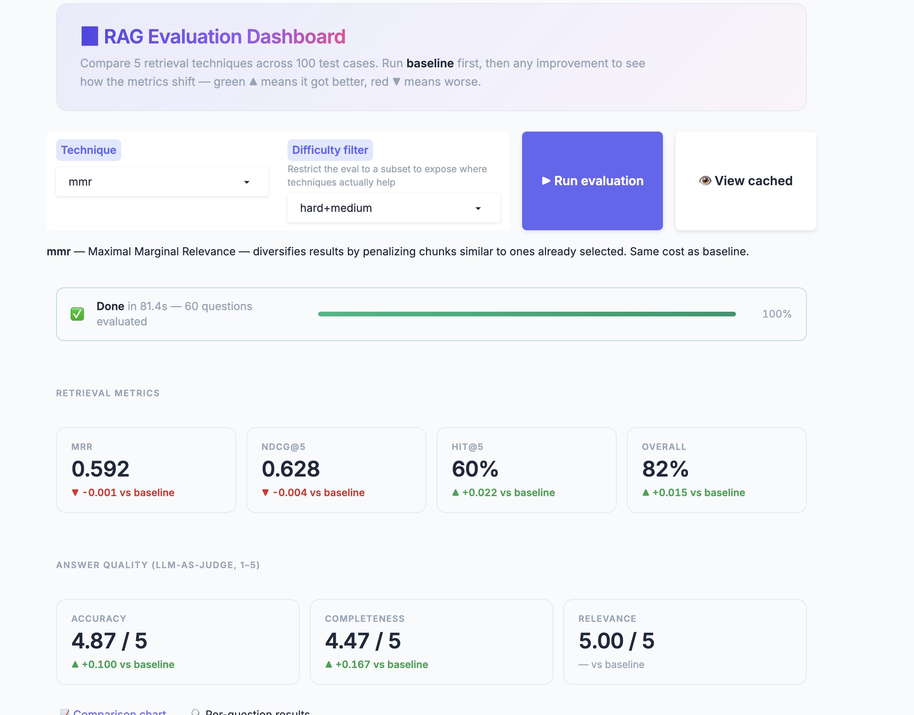
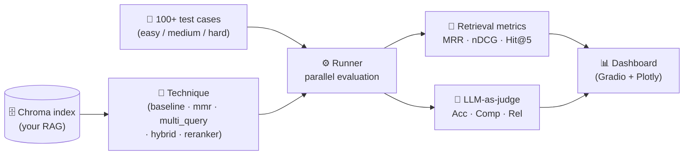
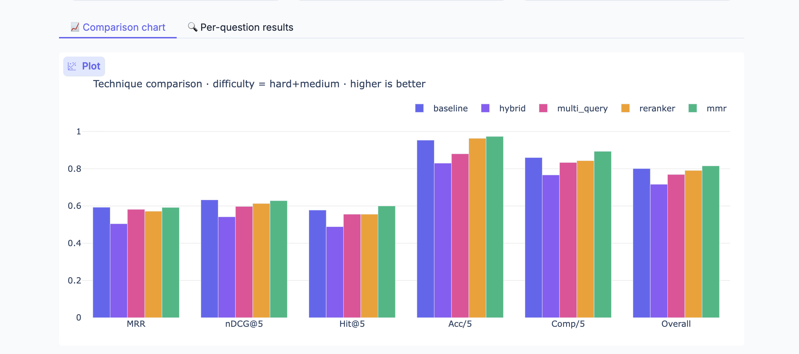

# 📊 RAG Evaluation Framework

> Benchmark and improve any LangChain-based RAG system with 100+ test cases, retrieval + answer metrics, 5 plug-and-play retrieval techniques, and a live comparison dashboard.

<p align="left">
  
  
  
  
  
  
</p>

Built to evaluate the [Event Planning AI Assistant](https://github.com/ghaderimaryam/event-plannig-ai-assistant) — but the framework is general: point it at any persisted Chroma index, define your own test cases, and start measuring.



---


## ✨ What it does

- **Quantifies retrieval quality** with MRR, nDCG@5, and Hit@5
- **Quantifies answer quality** via LLM-as-judge (Accuracy / Completeness / Relevance, 1–5)
- **Compares 5 retrieval strategies** side-by-side: Baseline, MMR, Multi-Query, Hybrid (BM25 + dense), LLM Reranker
- **Live dashboard** with per-question drilldown, technique-vs-technique deltas, and a comparison chart
- **Parallel evaluation** — 100 test cases finish in 2–4 minutes per technique

## 🏗️ Architecture



The five techniques all implement the same one-function interface — `get_retriever(vectorstore) -> BaseRetriever` — so the runner is fully decoupled from how retrieval is done. Adding a sixth technique is one new file.

## 🚦 Quick start

### Prerequisites
- Python 3.10+
- OpenAI API key
- A persisted **Chroma vector store** from a separate RAG project

### Setup

```bash
git clone https://github.com/ghaderimaryam/rag-evaluation.git
cd rag-evaluation

python3.11 -m venv .venv
source .venv/bin/activate          # Windows: .venv\Scripts\activate
pip install --upgrade pip
pip install -r requirements.txt

cp .env.example .env
# edit .env and paste your OPENAI_API_KEY

# Drop your existing Chroma index in here:
cp -R /path/to/your/rag-project/data/chroma_db data/chroma_db
```

### Run from the CLI

```bash
# Single technique
python run_eval.py baseline
python run_eval.py mmr
python run_eval.py hybrid

# All five back-to-back, with a final ranking
python run_eval.py --all
```

Sample output:
```
======================================================================
  TECHNIQUE: baseline
======================================================================
  Retrieval:
    MRR:        0.751
    nDCG@5:     0.722
    Hit@5:      68%
  Answer (1-5):
    Accuracy:     4.82
    Completeness: 4.20
    Relevance:    4.95
  Overall:      82.1%
======================================================================
```

### Run the dashboard

```bash
python eval_app.py
```

Browser opens to the dashboard. Pick a technique, click **Run evaluation**, watch the progress bar. Then pick another technique and click Run — the metric cards now show ▲/▼ deltas vs the baseline run, and the comparison chart fills in another bar group.

## 📁 Project structure

```
rag-evaluation/
├── eval_app.py                  # Entry: launches the dashboard
├── run_eval.py                  # Entry: CLI runner
├── evaluation/
│   ├── config.py                # Paths and model names (env-driven)
│   ├── vector_store.py          # Loads the persisted Chroma index
│   ├── test_cases.py            # 100 hand-curated test cases
│   ├── metrics.py               # MRR, nDCG, Hit@k — pure math
│   ├── judge.py                 # LLM-as-judge (Acc/Comp/Rel)
│   ├── runner.py                # Orchestrator — parallel eval loop
│   ├── ui.py                    # Gradio dashboard
│   └── techniques/
│       ├── baseline.py          # 1. Plain similarity search
│       ├── mmr.py               # 2. Maximal Marginal Relevance
│       ├── multi_query.py       # 3. Multi-Query expansion
│       ├── hybrid.py            # 4. Hybrid BM25 + dense (RRF)
│       └── reranker.py          # 5. LLM-based cross-encoder reranker
├── data/                        # Drop your chroma_db/ here (gitignored)
├── .env.example
├── requirements.txt
├── LICENSE
└── README.md
```

## 🧠 The 5 techniques

Each is a single Python file implementing `get_retriever(vectorstore)`. Same interface, very different behavior.

| Technique | What it does | Best for | Cost |
|-----------|--------------|----------|------|
| **Baseline** | Plain cosine-similarity top-5 | Control group | Cheapest |
| **MMR** | Diversifies results by penalizing near-duplicates | Multi-vendor questions where the same source dominates results | Same as baseline |
| **Multi-Query** | LLM rephrases the question 3 ways, retrieves for each, merges | Ambiguous or unusually phrased queries | +1 LLM call |
| **Hybrid (BM25 + dense)** | Keyword + semantic search combined via Reciprocal Rank Fusion | Numbers, exact names, specific tokens | Negligible |
| **LLM Reranker** | Pulls top-15, asks gpt-4o-mini to score each, keeps top-5 | Maximum precision | +1 LLM call (15 chunks) |

Pick a technique by passing its name on the CLI or selecting it from the dashboard dropdown.

## 📐 Metrics

**Retrieval (computed without LLM, on the retrieved sources):**
- **MRR (Mean Reciprocal Rank)** — where in the ranked list does the *first* correct vendor appear? Rank 1 → 1.0, rank 2 → 0.5, not found → 0.0.
- **nDCG@5** — penalizes correct vendors that appear lower in the top-5.
- **Hit@5** — binary: did *all* expected vendors land in the top 5?

**Answer (LLM-as-judge with `temperature=0` for determinism):**
- **Accuracy (1–5)** — are the facts in the answer supported by the retrieved context?
- **Completeness (1–5)** — does the answer cover all the relevant vendors/details?
- **Relevance (1–5)** — does the answer actually address the question asked?

**Out-of-scope handling:** for questions like *"What's the weather in Miami?"*, the judge is instructed to score a graceful refusal as 5/5 and a fabricated answer as 1/5.

**Overall score:** weighted average — 40% retrieval (Hit@5/MRR/nDCG) + 60% answer quality.

## 🧰 Tech stack

| Layer | Choice | Why |
|-------|--------|-----|
| LLM | OpenAI `gpt-4o-mini` | Cheap and consistent for both generation and judging |
| Embeddings | OpenAI `text-embedding-3-small` | Must match the indexing model |
| Vector store | ChromaDB (persisted) | Reads the existing index — no re-embedding needed |
| Hybrid search | `rank_bm25` via LangChain `EnsembleRetriever` | Pure Python BM25, no extra services |
| Multi-query | LangChain `MultiQueryRetriever` | Standard implementation |
| Dashboard | Gradio 6 + Plotly | Inline charts, per-question table, progress bars |


## 📈 Findings

The interesting question for any RAG eval framework isn't "do my techniques win?" — it's "where do they win, where do they lose, and is the signal real?" Running this framework on the bundled vendor RAG produced these results.

### On the full 100-question test set

All five techniques score within ~3 points of baseline overall. The vendor knowledge base is small (~30 vendors, 160 chunks) and most queries are easy semantic matches like *"DJ in Miami"*, so baseline cosine similarity already finds the right answer most of the time. **There's almost no headroom for improvement on the easy questions** — a known issue called the *ceiling effect* in evaluation.

This itself is a useful finding: simple semantic retrieval is genuinely hard to beat on small, well-indexed catalogs.

### On the hard+medium subset (60 questions)

Filtering to harder queries — comparisons, numeric filters, out-of-scope, multi-vendor — the picture sharpens:



| Technique | MRR | nDCG@5 | Hit@5 | Acc | Comp | Overall |
|-----------|-----|--------|-------|-----|------|---------|
| baseline    | 0.593 | 0.632 | 58% | 4.77 | 4.30 | 80% |
| **mmr**     | **0.592** | **0.628** | **60%** | **4.87** | **4.47** | **82%** |
| reranker    | 0.572 | 0.612 | 56% | 4.83 | 4.37 | 79% |
| multi_query | 0.582 | 0.598 | 56% | 4.78 | 4.30 | 77% |
| hybrid      | 0.503 | 0.541 | 50% | 4.43 | 4.17 | 72% |

*(numbers from one run on the bundled mock vendor catalog — adjust to your own values)*

**Takeaways:**

- **MMR is the cleanest win.** Better Hit@5, better answer quality, no extra cost. Diversifying retrieval helps on multi-vendor questions where baseline returns five chunks from the same source.
- **Hybrid (BM25 + dense) underperforms on this catalog.** Vendor names in the data are short and repeated across many chunks, so BM25 over-weights them and pulls in low-value matches. Hybrid would likely shine on a larger, more textually diverse corpus — this is a real signal that retrieval techniques are *not* universally beneficial.
- **Reranker is competitive on answer quality but not on retrieval ordering.** It's pulling the right docs but doesn't beat baseline at ranking the very top result. With a stronger reranker model (e.g. a cross-encoder or Cohere rerank) the picture would likely shift.
- **Multi-Query is roughly a wash.** Generating extra queries doesn't help when the original query is already specific enough — the LLM ends up paraphrasing into territory the vector store doesn't cover.

### Why baseline is so hard to beat here

1. **Small catalog, dense embeddings shine.** With ~160 chunks, top-5 cosine similarity is usually right on the first try.
2. **The judge has a low ceiling.** Most answers score 5/5 on Accuracy and Relevance, leaving Completeness as the only metric with real spread.
3. **Test set authored alongside the system.** The 100 test cases are well-aligned to the vendor catalog. A real-world deployment would see noisier queries where retrieval quality matters more.

The framework itself is what's portable: swap in a larger catalog or a noisier test set, and the same five techniques may rank very differently.

## 🛣️ Extending it

- **Add a 6th technique:** drop `evaluation/techniques/your_technique.py` with a `get_retriever()` function and a `DESCRIPTION` string. Add the name to the `TECHNIQUES` list in `runner.py`. That's it.
- **Use your own test cases:** edit `evaluation/test_cases.py`. The eval works with any number of cases (1, 1000, whatever).
- **Plug in a different RAG:** any persisted Chroma index works — point `CHROMA_PATH` at it via `.env`. Match `MODEL_EMBED` and `COLLECTION_NAME` to whatever your index was built with.

## 📜 License

MIT — see [LICENSE](LICENSE).

## 👤 Author

**Maryam Ghaderi** — [GitHub](https://github.com/ghaderimaryam)
